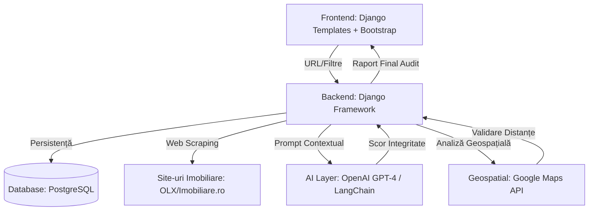
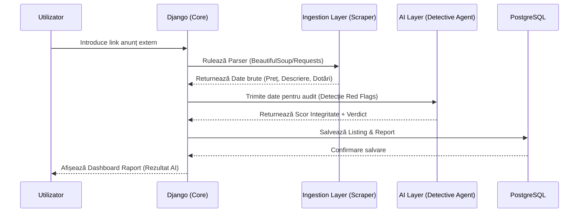
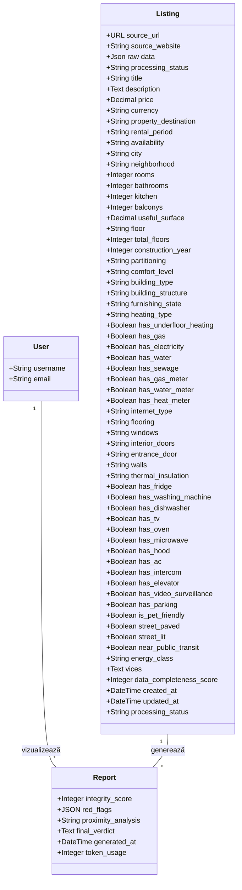

# 🏠 RentGuru - AI-Powered Real Estate Integrity Auditor

**RentGuru** este un sistem expert de audit imobiliar conceput pentru a proteja utilizatorii de fraude și de omisiuni critice în anunțurile de închirieri. Sistemul utilizează o arhitectură bazată pe micro-agenți AI pentru analiză textuală și geospațială.

---

## 🛠 Tehnologii Utilizate (Stack Tehnologic)
* **Backend:** Python 3.x cu framework-ul **Django**.
* **Bază de date:** **PostgreSQL** (pentru persistența utilizatorilor, istoricului și rapoartelor).
* **Frontend:** Django Templates + Bootstrap.
* **AI/ML:** OpenAI API (GPT-4) / LangChain pentru coordonarea agenților.
* **Geospatial:** Google Maps Platform API / OpenStreetMap.
* **Data Acquisition:** Playwright.

---

## 🏗 Arhitectura Sistemului

Sistemul este structurat pe patru straturi logice:

1.  **Ingestion Layer:** Modulul de Web Scraping care extrage datele brute din link-uri externe.
2.  **AI Analysis Layer:** * **Detective Agent:** Validare integritate, detecție "red flags", analiză anomalii de preț.
    * **Oracle Agent:** Calcul scor proximitate, validare distanțe reale, analiză facilități zonale.
3.  **Persistence Layer:** Baza de date PostgreSQL pentru stocarea profilurilor și a rapoartelor.
4.  **Presentation Layer:** Dashboard-ul web pentru vizualizarea scorului de onestitate.

---

## 📋 Backlog de Dezvoltare (Sprint-uri)

### 🔹 Sprint 1: Setup & Core
- [✓] Configurare proiect Django și conectare la instanța PostgreSQL.
- [✓] Definirea Modelelor (User, Report, Listing).
- [✓] Implementare sistem de autentificare (Login/Register).

### 🔹 Sprint 2: Data & Scraper
- [ ] Implementare Parser pentru platformele imobiliare (OLX/Imobiliare.ro).
- [ ] Validare formală a datelor (Data Cleaning & Regex).
- [✓] Creare diagrame UML.

### 🔹 Sprint 3: AI Agents Integration
- [✓] **Detective Agent:** Integrare LLM pentru analiza semantică a descrierilor.
- [ ] **Oracle Agent:** Integrare API Hărți pentru calcularea punctelor de interes.

### 🔹 Sprint 4: Finalization & Testing
- [✓] Generarea raportului de încredere (Onestitate + Lifestyle).
- [ ] Testare unitară (Unit Testing) și documentație finală.

---

## 📐 Arhitectură și Diagrame

### Diagrama 1: Arhitectura Componentelor
Acest grafic descrie interacțiunea dintre serverul Django, baza de date PostgreSQL și serviciile externe de AI și Scraping.

### Diagrama 2: Fluxul de Audit Imobiliar (AI Agents)
Descrie procesul prin care un link de anunț este prelucrat de sistem pentru a genera un raport de încredere.

### Diagrama 3: Diagrama de Clase (Modele de Date)
Această diagramă reflectă structura bazei de date definită în modelele proiectului.

---

## 🧪 Verificări Formale & Calitate
* **Validare Date:** Verificarea integrității JSON-urilor returnate de agenți.
* **Cross-Check:** Compararea facilităților declarate în text cu datele geografice reale.
* **Design Patterns:** Utilizarea pattern-urilor *Strategy* (pentru profiluri utilizator) și *Singleton* (pentru conexiunea la DB).
